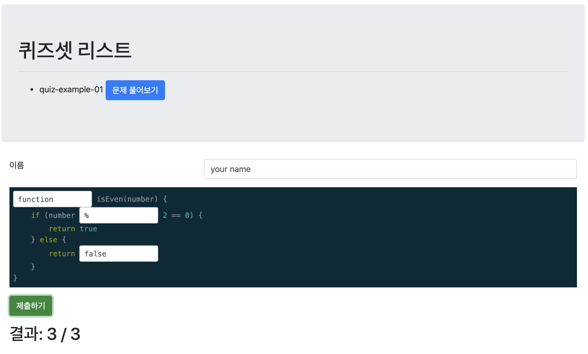
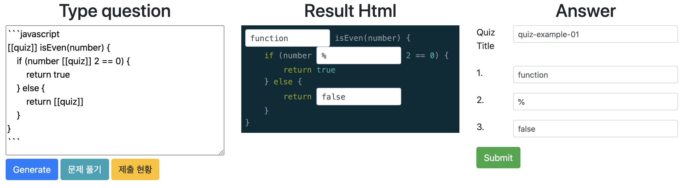
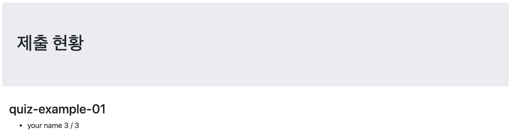

# Quiz Generator
빈칸 채워넣기 퀴즈 생성기입니다.

퀴즈를 만들고 정답을 넣어 퀴즈셋을 생성할 수 있습니다.

생성한 퀴즈를 풀면 제출한 사람의 이름과 제출한 답안이 저장되고, 바로 채점해줍니다.

## 사용 방법

1. mongodb 설치
2. python3 설치 후 아래 스크립트 실행
```bash
git clone https://github.com/pierceh89/quiz-gen.git
cd quiz-gen
python3 -m venv venv
source venv/bin/activate
pip install -r requirements.txt
export AUTH=password # submission 확인할 때 사용할 패스워드 입력
gunicorn -w 2 -b 0.0.0.0:5000 app:app
```
3. quiz 예제는 [example](example) 참조

## 프론트
- `/` : 만든 퀴즈셋 리스트가 나오고 문제를 풀 수 있는 화면

- `/gen` : 퀴즈셋을 만드는 화면

- `/sub` : 제출 현황을 확인하는 화면


## 사용한 언어/라이브러리

- [Flask](https://flask.palletsprojects.com/) (python)
- [MongoDB](https://www.mongodb.com/)
- [jQuery](https://jquery.com/) (javascript)
- [hljs](https://highlightjs.org/) (javascript)
- [Bootstrap](https://getbootstrap.com/)
